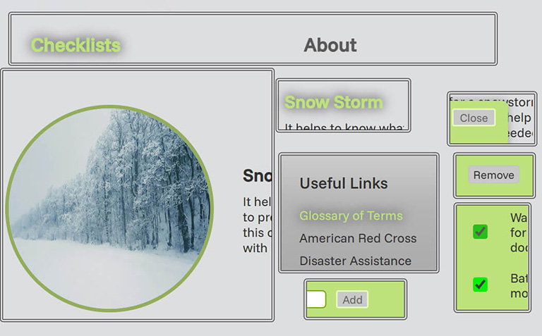

# Disaster Prepardness Site

## Overview

- Intro
- Description
- Tech Stack
- Images

## Intro

A site for people to use when preparing for or dealing with a natural disaster in their area. This project was created as part of the TripleTen Jan 2025 Code Jam.

## Description

The Disaster Prepardness website by Team Readyness is a service for people to plan and manage care
for themselves and their loved ones during times of crisis. Users will be able to check items off a
pre-made checklist of essential items needed or recommended during a natural disaster. They can also
add items to each of the list for added customization.

## Tech Stack

- HTML
- CSS
- Responsive Design
- JavaScript

## Images

### Desktop

### Mobile

### Effects

## Link

[Disaster Preparedness Website](https://harshiisingh.github.io/disaster-preparedness/ "Disaster Preparedness")
